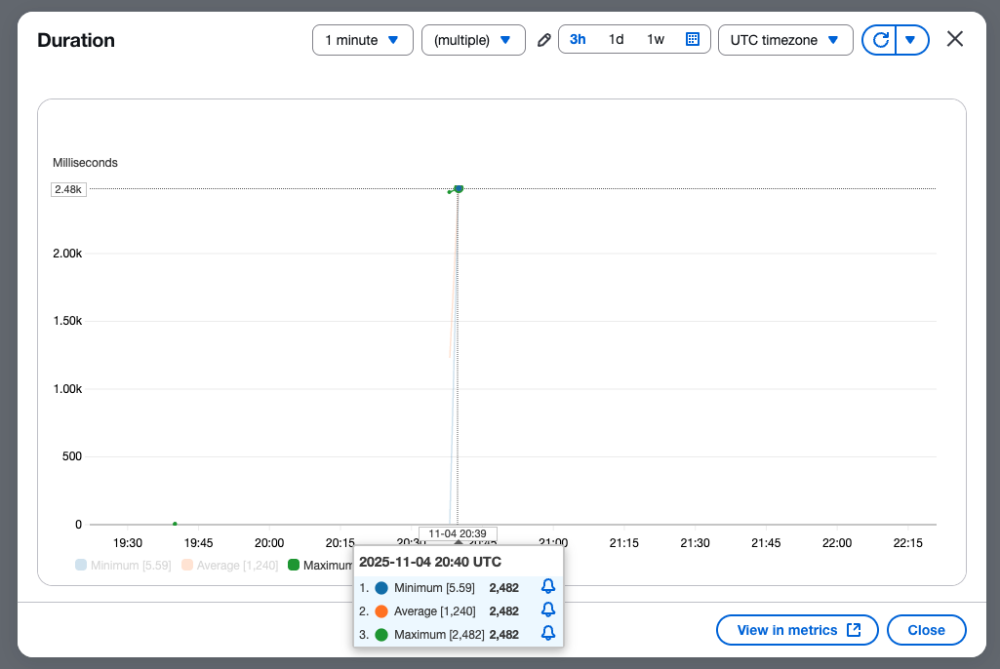
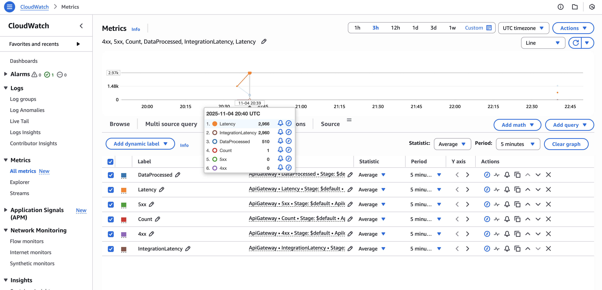
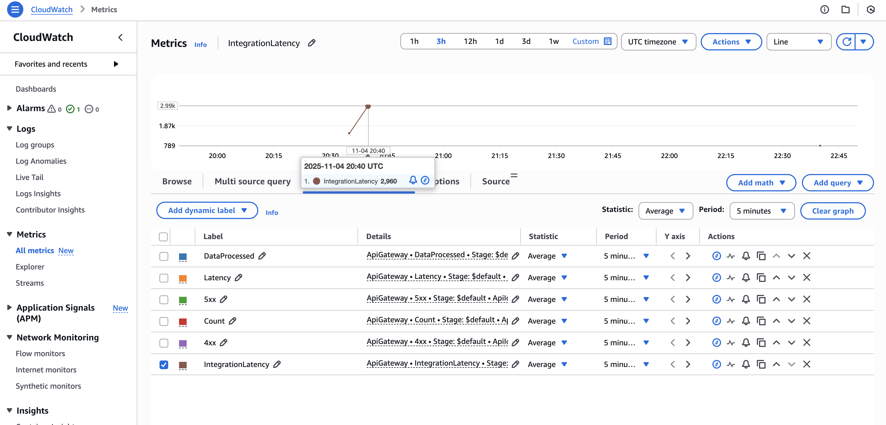
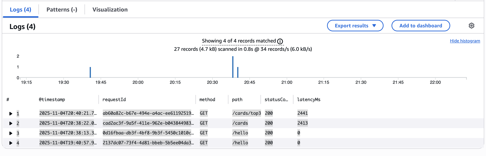

# ⚾️ Serverless Retail Data API — *Baseball Rookie Cards (Japanese MLB Players)*

[](https://aws.amazon.com/serverless/sam/)
[](https://aws.amazon.com/lambda/)
[](https://aws.amazon.com/api-gateway/)
[](https://aws.amazon.com/dynamodb/)
[](https://aws.amazon.com/cognito/)
[](LICENSE)

---

## 🧠 Overview

A **fully serverless API** built using the **AWS Serverless Application Model (SAM)** — integrating **Lambda**, **HTTP API Gateway**, **DynamoDB**, and **Cognito Authorizer**, with full **CloudWatch monitoring**, **structured logging**, and **SNS email alerts** for operational awareness.

This project tracks **Japanese MLB players’ rookie cards** and demonstrates **real-world AWS skills** across Infrastructure as Code, observability, and secure API design.

---

## 🏗️ Architecture

```
┌───────────────────────────────┐
│        Amazon Cognito         │
│   (JWT-based AuthN/AuthZ)     │
└──────────────┬────────────────┘
               │
               ▼
┌───────────────────────────────┐
│ Amazon API Gateway (HTTP API) │
│  • /cards, /top3, /seed       │
└──────────────┬────────────────┘
               │
               ▼
┌───────────────────────────────┐
│     AWS Lambda (Python 3.13)  │
│  app.lambda_handler           │
└──────────────┬────────────────┘
               │
               ▼
┌───────────────────────────────┐
│     Amazon DynamoDB Table     │
│   PK (player), SK (year)      │
└───────────────────────────────┘
```

---

## 🚀 Deployment Instructions

```bash
sam build
sam deploy --guided
```

Choose:
- Stack name: `serverless-retail-api`
- AWS Region: `us-west-1`
- Profile: `serverless-retail-api-user`

Once deployed, retrieve the API endpoint:

```bash
aws cloudformation describe-stacks \
  --stack-name serverless-retail-api \
  --query "Stacks[0].Outputs"
```

---

## 🔗 API Endpoints

| Method | Route | Auth | Description |
|:------:|:------|:----:|:-------------|
| `GET` | `/hello` | ❌ | Health check endpoint |
| `GET` | `/cards` | ❌ | Returns all player cards |
| `GET` | `/cards/{cardId}` | ❌ | Retrieves card details by ID |
| `GET` | `/cards/top3` | ❌ | Lists top 3 rookie cards |
| `POST` | `/cards/seed` | ✅ Cognito | Seeds the database with sample records |

---

## 📦 Example Responses

### ✅ GET `/cards`
```json
[
  {
    "player": "Shohei Ohtani",
    "team": "Los Angeles Dodgers",
    "rookieYear": 2013
  },
  {
    "player": "Yu Darvish",
    "team": "San Diego Padres",
    "rookieYear": 2005
  }
]
```

### ✅ GET `/cards/top3`
```json
[
  { "player": "Shohei Ohtani", "ranking": 1 },
  { "player": "Seiya Suzuki", "ranking": 2 },
  { "player": "Kodai Senga", "ranking": 3 }
]
```

### ✅ POST `/cards/seed`
**Headers:**
```
Authorization: Bearer <Cognito JWT Token>
```
**Response:**
```json
{ "message": "Cards seeded successfully!" }
```

---

## 🧭 Monitoring & Observability

### 🔹 Lambda Duration (Cold Start vs Warm Invocations)
*Screenshot: Lambda console “Monitoring” tab*



---

### 🔹 API Gateway Latency Metrics
*Screenshot: CloudWatch → Metrics → ApiGateway → Latency*



---

### 🔹 Integration Latency (Backend processing time)
*Screenshot: CloudWatch → Metrics → ApiGateway → IntegrationLatency*



---

### 🔹 CloudWatch Logs Insights Query Results
*Screenshot: CloudWatch Logs → Insights query for latencyMs, status, route*



---

## 🧩 Operational Intelligence

**CloudWatch Alarms:**  
- Trigger: `5XXError ≥ 1` within 5 minutes  
- Action: SNS Email → `serverless-retail-api-alerts` topic  

**SNS Subscription:**  
Email-based alert tested and verified with sample message.  
**State:** `OK`

---

## 💰 Cost Estimate

| Service | Tier | Monthly Cost (est.) |
|----------|------|---------------------|
| Lambda (100 req/day) | Free | ~$0.00 |
| API Gateway (HTTP) | Free | ~$0.01 |
| DynamoDB (Pay-per-request) | Free | ~$0.03 |
| CloudWatch Logs | Free | ~$0.01 |
| **Total** | | **≈ $0.05/month** |

---

## 📚 Skills Demonstrated

- Infrastructure as Code (AWS SAM)
- Serverless API design with Cognito JWT authentication
- DynamoDB schema modeling (PK/SK)
- CloudWatch Logs & Metrics Insights
- SNS Alarms for real-time monitoring
- Cost-aware cloud architecture
- Python Lambda development
- GitHub-ready documentation with visual observability

---

## 🌟 Future Enhancements

- Add `/players` search endpoint for broader queries  
- Introduce AWS X-Ray tracing visualization  
- Optionally deploy via CI/CD pipeline (GitHub Actions + SAM)  
- Cache DynamoDB reads with AWS DAX for sub-millisecond latency  

---

## 👨‍💻 Author

**Kenjamin Button**  
Cloud Developer & AWS Certified Solutions Architect  
🔗 [kenjaminbutton.com](https://kenjaminbutton.com)

---

> _“Every log line tells a story — this one just happens to end in a successful deploy.”_
